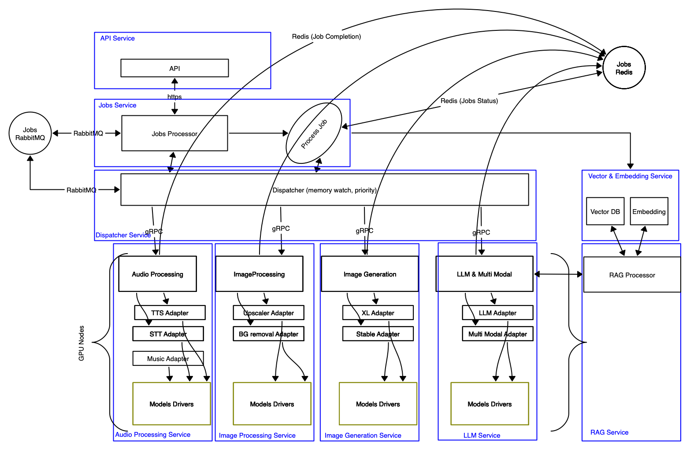

# spt-smi : Sponge Theory Scalable Models Inferences

This framework allows for scalable model inference on various computational resources, with a focus on GPU utilization. It provides a flexible and efficient solution for running machine learning models, particularly in the domain of image generation, text generation, text embedding, RAG...

This framework allows you to work with sensitive company data in a very secure manner. It ensures that no data is sent to major LLM companies such as OpenAI, providing a safe environment for handling proprietary and confidential information. By keeping all data processing and model inference within your own infrastructure, you can maintain full control over your data privacy and security.


## Key Features

1. **Multiple Model Support**: Includes support for various AI models, including Stable Diffusion, any inference API compatible with Hugging Face Transformers, and potentially others.

2. **Scalable Architecture**: Designed to work across different computational resources, optimizing for GPU usage.

3. **Docker Integration**: Utilizes Docker for easy deployment and scalability, deployable as stack of services (api, rabbitmq, redis, models workers) in swarm mode.

4. **API-driven**: Offers a Flask-based API for easy integration and access to model inferences.

5. **Distributed Computing**: Incorporates RabbitMQ and Redis for distributed task management, caching and asynchronous jobs processing.

6. **Flexible Model Loading**: Supports loading models from various sources, including local files and Hugging Face repositories.

7. **CUDA Support**: Optimized for NVIDIA GPUs with CUDA support.

8. **Extensible Worker System**: Implements a worker system that can be extended to support different types of models and inference tasks. The workers are loaded dynamically at runtime from the classes defined in the /workers directory.

9. **Support for Apple Silicon**: Utilizes MLX for efficient GPU processing on Apple Silicon devices.

10. **Prometheus and Grafana**: Utilizes Prometheus for monitoring and Grafana for visualization.

## Technologies Used

- Python 3.11
- CUDA 12.2
- Docker and Docker Compose
- Flask
- RabbitMQ
- Redis
- Hugging Face Transformers and Diffusers
- NVIDIA CUDA libraries
- Suport for MLX on Apple Silicon

This framework is designed for researchers, developers, and organizations looking to deploy and scale AI model inferences efficiently. It provides a robust foundation for building complex AI-powered applications with a focus on image generation and processing tasks.

## Architecture



## Set up


### RabbitMQ

docker run -d --hostname smi_rabbit --name rabbit -p 15672:15672 -p 5672:5672 -e RABBITMQ_DEFAULT_USER=root -e RABBITMQ_DEFAULT_PASS=jskdljflskdjflkjsqkjflkjqsldf564654 rabbitmq:3-management

### Redis 

docker run -d --name redis-stack-server -p 6379:6379 redis/redis-stack-server:latest


```
 python -m venv .venv
 source .venv/bin/activate
 pip  install -r requirements.txt
```

### API

flask --app src/api run --port 8999 --debug

### Setup project 

python -m pip install --editable .
python -m pip freeze --exclude-editable > constraints.txt

## Install project

python -m pip install -c constraints.txt .

### Build Docker Image

## Build docker image for local Docker server 
docker build -t spt-smi:$(git rev-parse --short HEAD) .


## Build docker image for amd64 (intel) useful if building on Mx Mac and distributing to Docker Intel servers
docker build -t spt-smi:$(git rev-parse --short HEAD) --platform linux/amd64 .

###  Tag and upload image

docker tag spt-smi:$(git rev-parse --short HEAD) spongetheory/spt-smi:$(git rev-parse --short HEAD)
docker tag spt-smi:$(git rev-parse --short HEAD) spongetheory/spt-smi:latest

docker push spt-smi:$(git rev-parse --short HEAD)
docker push spongetheory/spt-smi:latest

### rebuild container
docker compose build
docker compose up --build

## Website and Contact Information

For more information, please visit our website: [Sponge Theory](https://sponge-theory.ai).

### Hire Me

I am available for freelance work to help integrate this framework into your projects. If you are interested, please contact me at: christophe.verdier@sponge-theory.io
